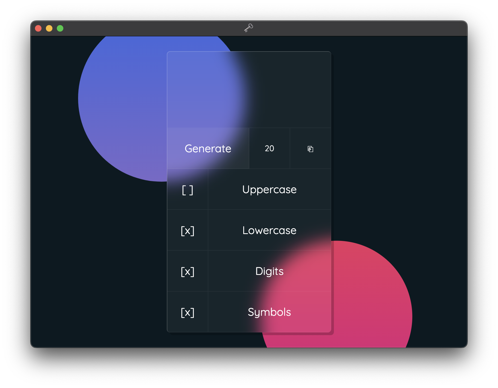

# Glassword

<u>Glassmorphism Password Generator</u>

## Description

The Glassmorphism Password Generator is a web-based user interface (UI) that generates secure passwords based on the recommendations provided by ANSSI (Agence nationale de la sécurité des systèmes d'information). The UI is designed using the Glassmorphism trend, which provides a modern and sleek look.

## Features

- Generates secure passwords using a combination of letters (uppercase and lowercase), numbers, and special characters.
- Allows users to specify the length of the generated password.
- Provides options to include or exclude specific character types in the generated password (e.g., uppercase letters, lowercase letters, numbers, special characters).
- Displays the password strength in real-time, indicating the level of security.
- Allows users to copy the generated password to the clipboard for easy pasting.
- Follows the recommendations provided by ANSSI for creating strong and secure passwords.

## Screenshot

## How to Use

1. Open the password generator in a web browser or as a standalone app in Electron.
2. Adjust the settings, such as password length and character types, as desired.
3. Click the "Generate" button to generate a new password.
4. The generated password will be displayed on the screen along with its strength indication.
5. Click the "Copy" button to copy the generated password to the clipboard for use in other applications or websites.

## Technologies Used

- HTML
- CSS
- JavaScript
- ANSSI recommendations for password generation
- Glassmorphism UI design trend

## Roadmap

- Add support for additional password generation options, such as passphrase generation, custom character sets, and word-based passwords.
- Implement password strength meter based on industry-standard algorithms.
- Enhance the user interface and design with more Glassmorphism elements.
- Add localization support for multiple languages.
- Implement unit tests and improve security measures.

## Feedback and Contributions

Feedback and contributions are welcome! Please report any issues or suggestions on the [GitHub repository](https://github.com/Fastiraz/Glassword/).

## License

This password generator is released under the [MIT License](LICENSE).

